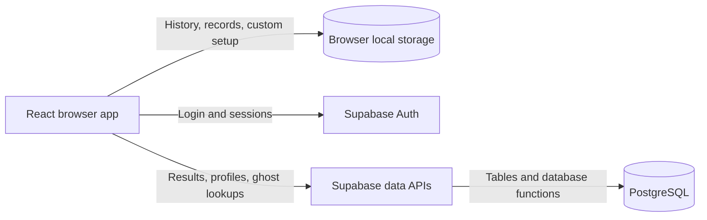

# KEYSMASH

KEYSMASH is a browser typing app for practicing speed and accuracy through timed tests, custom text, and ghost races. It combines a bold visual style with a responsive layout and keyboard controls.

Users can choose a test duration and word count, type their own practice passages, and review results through WPM, accuracy, consistency, missed keys, and pace charts. Local history and personal bests help track progress across sessions.

The app includes:

- Timed tests with 15, 30, 60, and 120-second options.
- Custom practice text up to 2,000 characters, with remembered applied text and timer settings when browser storage is available.
- Local run history and standard personal bests.
- Optional Google and email magic-link login, session restoration, and cloud saving for standard runs.
- Publishable profiles with performance summaries, weekly improvement, and activity charts.
- Ghost races against personal bests or published profile records.
- A sticky navbar and hamburger menu on phones.

Guest typing works without an account. Custom practice results remain local and do not affect standard personal bests or ghost races. Account and cloud features require Supabase configuration.

Built with **React**, **JavaScript**, **Vite**, **Tailwind CSS**, and **Supabase**.

## Architecture

KEYSMASH is a React single-page application. Typing, timing, scoring, and ghost playback run in the browser. Optional Supabase services provide authentication and cloud data through direct calls from the frontend.

### Browser application

React components present the typing workspace, results, history, profiles, and navigation. The typing engine generates repeatable word sets from a seed, calculates scores, and records pace samples. Ghost playback uses the same seeded text with a recorded progress trace or an average-pace fallback.

Vite provides the development server and builds the application into static files. Custom CSS and Tailwind CSS support the visual styling and responsive layout.

### Local persistence

Browser local storage holds recent runs, standard personal bests, and the applied custom text and timer. Run history falls back to memory for the current session when storage cannot be written. Custom practice remains on the device and is excluded from standard records and cloud saving.

### Authentication and cloud data

Supabase Auth handles Google and email magic-link login and session restoration. Signed-in users can save completed standard runs to the cloud and manage their profile's handle and publication state.

The frontend accesses PostgreSQL through Supabase table APIs and database functions. SQL migrations define the schema, owner access policies, profile summaries, weekly trends, activity data, and ghost lookups. Public profile and ghost functions return the data needed for those features rather than exposing private run history.

### Hosting

The repository has no separate application server. Vercel serves the static frontend, while its configured rewrites let profile, history, login callback, and ghost-race URLs load the application directly. Supabase supplies the optional backend services.
